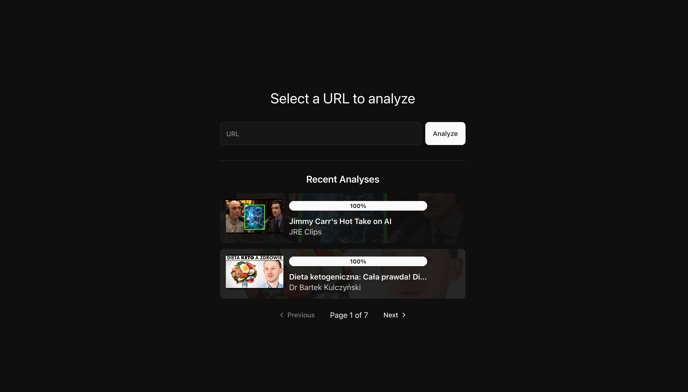
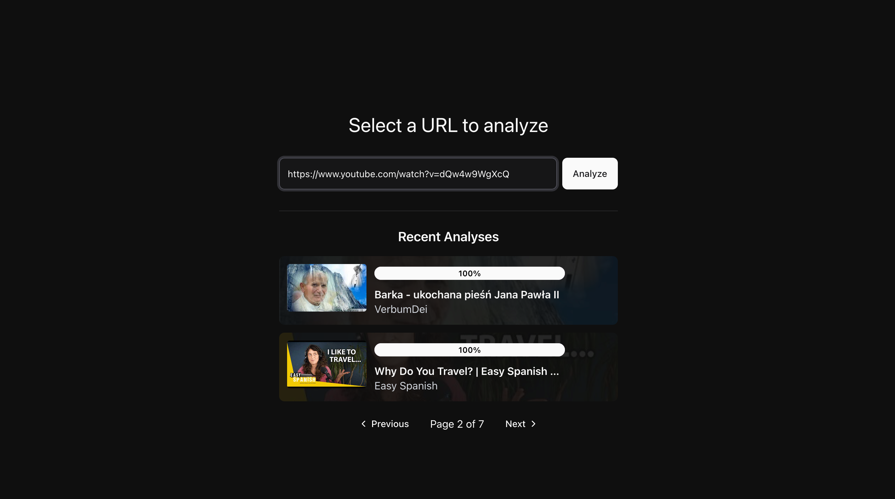
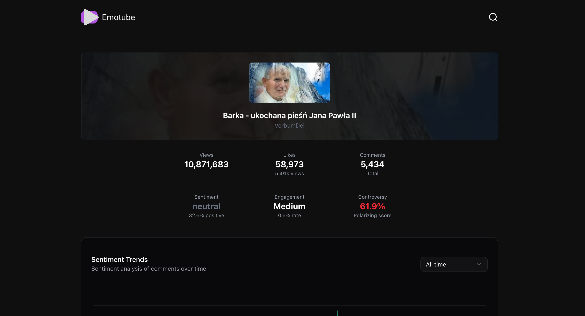
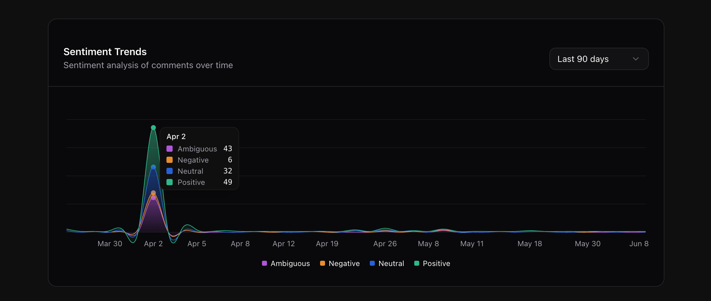
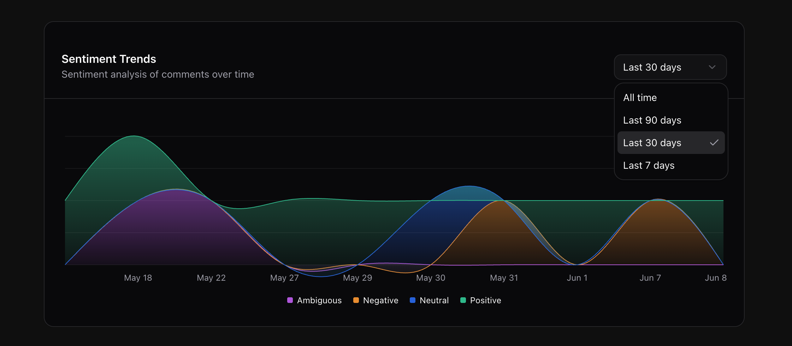
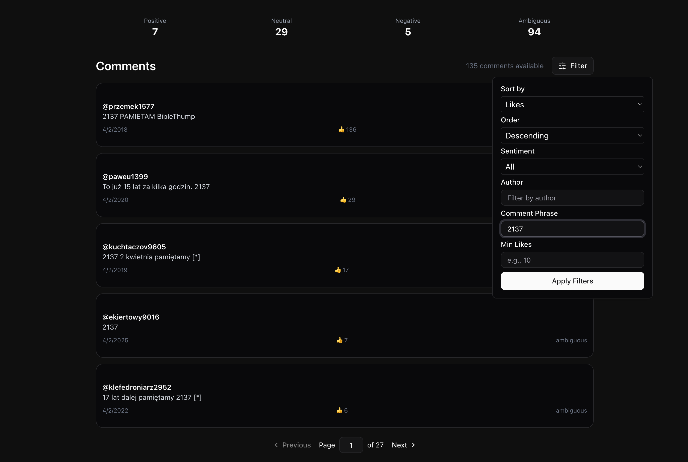

# 🎭 Emotube: Advanced Social Media Sentiment Analyzer

<div align="center">


**A powerful, containerized web application for analyzing sentiment in social media comments**

[](https://fastapi.tiangolo.com/)
[](https://reactjs.org/)
[](https://www.typescriptlang.org/)
[](https://www.docker.com/)
[](https://www.postgresql.org/)

</div>

---

## 🌟 Overview

Emotube is a cutting-edge sentiment analysis platform that transforms social media engagement data into actionable insights. Currently featuring **YouTube comment analysis**, the platform is designed with extensibility in mind to support multiple social media platforms including **Facebook**, **Reddit**, **Twitter**, **Instagram**, and **TikTok**.

### ✨ Key Features

- **🎯 Real-time Sentiment Analysis** - Advanced ML-powered sentiment classification
- **📊 Interactive Dashboards** - Beautiful, responsive data visualizations
- **🐳 Dockerized Architecture** - Full containerization for easy deployment
- **⚡ Async Processing** - Background comment analysis with live progress updates
- **🔍 Advanced Filtering** - Filter by sentiment, author, engagement metrics, and keywords
- **📈 Comprehensive Analytics** - Detailed metrics and trend analysis
- **🌐 Multi-platform Ready** - Extensible architecture for additional social media platforms

---

## User Interface








---

## 🏗️ Architecture

The project follows a modern microservices architecture with complete Docker containerization:

```
Emotube/
├── 🐳 docker-compose.yml           # Multi-service orchestration
├── 🔧 .env.example                 # Environment configuration template
├── 🌐 frontend/                    # React TypeScript Frontend
│   ├── 🐳 Dockerfile               # Frontend container config
│   ├── 📦 package.json             # Dependencies (Bun runtime)
│   ├── ⚙️ vite.config.js           # Build configuration
│   └── 📁 src/
│       ├── 🎨 components/          # React components
│       │   ├── ui/                 # ShadCN UI components
│       │   ├── VideoDetails.tsx    # Video metadata display
│       │   ├── CommentSection.tsx  # Comment analysis interface
│       │   ├── CommentCharts.tsx   # Data visualization charts
│       │   └── AnalyzedVideoList.tsx # Video history
│       ├── 🚦 routes/              # TanStack Router pages
│       ├── 🔗 services/            # API service layer
│       ├── 🎯 hooks/               # Custom React hooks
│       └── 📝 types/               # TypeScript definitions
├── ⚡ backend/                     # FastAPI Python Backend
│   ├── 🐳 Dockerfile               # Backend container config
│   ├── 📋 requirements.txt         # Python dependencies
│   ├── 📚 overview.md              # Detailed backend documentation
│   └── 📁 app/
│       ├── 🚀 main.py              # FastAPI application entry
│       ├── 🌐 api/
│       │   ├── routes/             # API endpoints
│       │   │   ├── videos.py       # Video analysis endpoints
│       │   │   ├── comments.py     # Comment retrieval & filtering
│       │   │   └── chart_data.py   # Analytics data endpoints
│       │   └── logic/              # Business logic layer
│       ├── ⚙️ core/
│       │   ├── config.py           # Application configuration
│       │   ├── sentiment/          # Sentiment analysis engine
│       │   └── integrations/       # Social media platform integrations
│       │       └── youtube/        # YouTube API integration
│       ├── 🗄️ db/
│       │   ├── session.py          # Database session management
│       │   └── init_db.py          # Database initialization
│       ├── 📊 models/              # SQLModel database models
│       ├── 📝 schemas/             # Pydantic API schemas
│       ├── 🔧 crud/                # Database operations
│       └── 🛠️ utils/               # Utility functions
└── 🗄️ PostgreSQL Database         # Persistent data storage
```

---

## 🚀 Tech Stack

### Backend

- **🐍 Python 3.11** with **FastAPI** - High-performance async API framework
- **🤖 Transformers & PyTorch** - Advanced sentiment analysis models
- **🗄️ PostgreSQL + SQLModel** - Robust database with async ORM
- **📡 Google API Client** - YouTube Data API integration
- **⚡ Uvicorn** - ASGI server with auto-reload

### Frontend

- **⚛️ React 19** with **TypeScript** - Modern UI framework
- **🦄 Bun** - Ultra-fast JavaScript runtime and package manager
- **🧭 TanStack Router** - Type-safe routing with devtools
- **🔄 TanStack Query** - Powerful async state management
- **🎨 Tailwind CSS** - Utility-first styling framework
- **🧩 ShadCN/UI** - Beautiful, accessible component library
- **📊 Recharts** - Responsive data visualization
- **⚡ Vite** - Lightning-fast build tool

### Infrastructure

- **🐳 Docker & Docker Compose** - Complete containerization
- **🔒 Environment-based Configuration** - Secure secrets management
- **🌐 CORS-enabled API** - Cross-origin resource sharing
- **📝 Auto-generated API Docs** - Interactive Swagger/OpenAPI

---

## 🚀 Quick Start

### Prerequisites

- 🐳 **Docker** and **Docker Compose**
- 🔑 **YouTube Data API v3 Key** ([Get one here](https://developers.google.com/youtube/v3/getting-started))

### 1. Clone the Repository

```bash
git clone https://github.com/00200200/Comment-Sentiment-Analyzer.git emotube
cd emotube
```

### 2. Environment Setup

```bash
# Copy environment template
cp .env.example .env

# Edit .env file with your configuration
nano .env  # or use your preferred editor
```

**Required environment variables:**

```env
# YouTube API Configuration
YOUTUBE_API_KEY=your_youtube_api_key_here

# Service Configuration
HOST=0.0.0.0
BACKEND_PORT=8000
FRONTEND_PORT=3000

# Database Configuration
POSTGRES_USER=emotube_user
POSTGRES_PASSWORD=secure_password_here
POSTGRES_DB=emotube_db
POSTGRES_HOST=db
POSTGRES_PORT=5432

# Frontend Configuration
VITE_BACKEND_URL=http://localhost:8000
```

### 3. Launch with Docker

```bash
# Start all services
docker-compose up -d

# View logs (optional)
docker-compose logs -f
```

### 4. Access the Application

- 🌐 **Frontend**: [http://localhost:3000](http://localhost:3000)
- ⚡ **Backend API**: [http://localhost:8000](http://localhost:8000)
- 📚 **API Docs**: [http://localhost:8000/docs](http://localhost:8000/docs)
- 🗄️ **Database**: `localhost:5432`

---

## 🎯 Usage

### Analyzing YouTube Videos

1. **📱 Navigate** to the frontend application
2. **🔗 Enter** a YouTube video URL
3. **⚡ Watch** real-time sentiment analysis progress
4. **📊 Explore** interactive charts and comment insights
5. **🔍 Filter** comments by sentiment, author, or keywords
6. **📈 View** comprehensive analytics and trends

### API Endpoints

#### Videos

- `GET /videos` - List analyzed videos (paginated)
- `GET /videos?url={youtube_url}` - Analyze new video or get existing analysis

#### Comments

- `GET /comments?url={youtube_url}` - Get comments with advanced filtering:
  - `sentiment` - Filter by sentiment (positive/negative/neutral)
  - `author` - Filter by author name
  - `min_likes` - Minimum like count
  - `phrase` - Text search within comments
  - `sort_by` - Sort field (published_at, like_count, sentiment)
  - `sort_order` - asc/desc

#### Analytics

- `GET /chart-data?url={youtube_url}` - Get visualization data

---

## 🌐 Platform Extensibility

Emotube is architected for **easy expansion** to additional social media platforms:

### 🔄 Currently Supported

- **📺 YouTube** - Complete comment sentiment analysis

### 🚀 Ready for Integration

The modular architecture supports adding:

- **📘 Facebook** - Posts and comment analysis
- **🔴 Reddit** - Subreddit and thread sentiment
- **🐦 Twitter/X** - Tweet and reply analysis
- **📷 Instagram** - Comment sentiment on posts and reels
- **🎵 TikTok** - Video comment analysis
- **💼 LinkedIn** - Professional content engagement
- **📱 Discord** - Server message sentiment

### 🛠️ Adding New Platforms

1. **Create Integration Module**:

   ```python
   # backend/app/core/integrations/platform_name/
   ├── client.py          # Platform API client
   ├── models.py          # Platform-specific data models
   └── sentiment.py       # Platform-specific processing
   ```

2. **Extend API Routes**:

   ```python
   # Add new endpoints in backend/app/api/routes/
   @router.get("/platform_name/analyze")
   async def analyze_platform_content(url: str):
       # Implementation
   ```

3. **Update Frontend**:
   ```typescript
   // Add platform-specific components and services
   // Extend URL parsing and validation
   ```

---

## 🛠️ Development

### Local Development Setup

```bash
# Backend development
cd backend
python -m venv venv
source venv/bin/activate  # Windows: venv\Scripts\activate
pip install -r requirements.txt
uvicorn app.main:app --reload

# Frontend development
cd frontend
bun install
bun run start
```

### Docker Development

```bash
# Rebuild and restart services
docker-compose down
docker-compose up --build

# View service logs
docker-compose logs backend
docker-compose logs frontend
docker-compose logs db
```

### Database Management

```bash
# Access PostgreSQL
docker-compose exec db psql -U emotube_user -d emotube_db

# Backup database
docker-compose exec db pg_dump -U emotube_user emotube_db > backup.sql

# View database logs
docker-compose logs db
```

---

## 📊 Features Deep Dive

### Sentiment Analysis Engine

- **🤖 Multi-model Support** - Hugging Face Transformers integration
- **⚡ Async Processing** - Background analysis with progress tracking
- **🎯 Confidence Scoring** - Sentiment confidence metrics
- **🔄 Batch Processing** - Efficient comment processing in chunks

### Data Visualization

- **📈 Sentiment Distribution** - Pie charts and bar graphs
- **📊 Timeline Analysis** - Sentiment trends over time
- **🔥 Engagement Metrics** - Like/dislike correlation analysis
- **☁️ Word Clouds** - Popular terms and phrases

### Performance Features

- **⚡ Lazy Loading** - Progressive data loading
- **🔄 Real-time Updates** - Live analysis progress
- **💾 Persistent Storage** - PostgreSQL with proper indexing
- **🚀 Caching Strategy** - Optimized data retrieval

---
